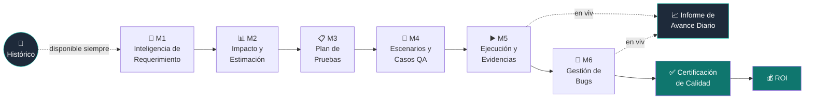
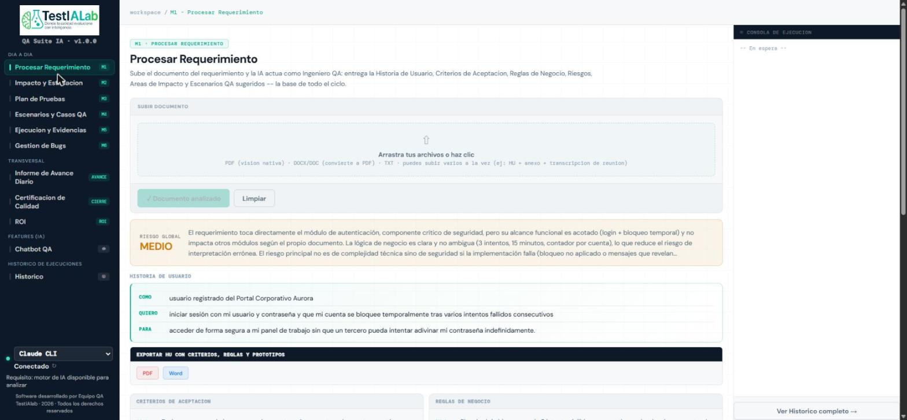
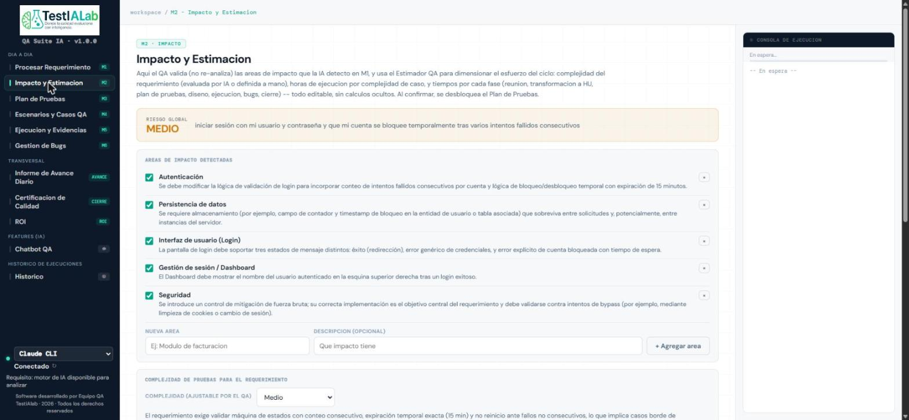
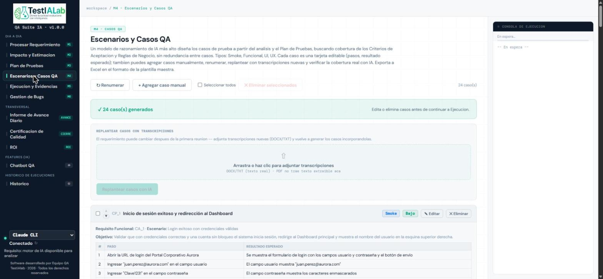
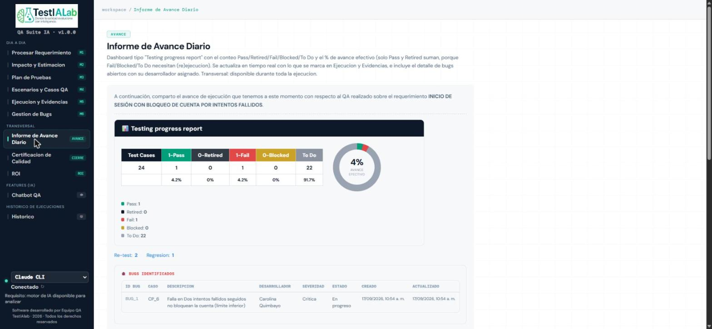

# 🧪 TestIALab QA Suite IA


**Copiloto de QA potenciado por IA que acompaña todo el ciclo de pruebas de software** — desde que llega un requerimiento hasta la certificación final de calidad — generando en el camino los documentos reales que hoy el equipo de QA de TestIALab producía a mano: Historia de Usuario, Plan de Pruebas, Casos de Prueba, Informe de Avance, Bug Tracker y Certificación de Calidad.

---

## 📌 ¿Qué es la QA Suite?

Cualquier ciclo de QA formal implica una cadena de documentos que dependen unos de otros: se analiza un requerimiento, se estima el esfuerzo, se redacta un plan de pruebas, se diseñan los casos, se ejecutan, se reportan los bugs, se informa el avance y finalmente se certifica la calidad. Hacer esto a mano es lento y propenso a que un documento pierda coherencia con el anterior.

La QA Suite usa un modelo de lenguaje (Claude o Gemini, a elección) como un **Ingeniero de QA senior** en cada etapa: lee el requerimiento real (texto, imágenes, tablas, wireframes), entiende el negocio, y produce cada documento del ciclo manteniéndolos coherentes entre sí — el Plan de Pruebas cita los mismos criterios que detectó el análisis inicial, los casos de prueba cubren exactamente esos criterios, y la Certificación final se apoya en lo que ya se aprobó en el Plan, sin volver a inventar el alcance desde cero.

Es una aplicación **100% local**: corre en la máquina del QA, no depende de ningún servidor externo propio, y todo el historial de ejecuciones vive en el navegador de quien la usa.

---

## 🔄 El ciclo completo, módulo por módulo



| Módulo | Qué hace | Qué produce |
|---|---|---|
| 📂 **Histórico** | Transversal, siempre disponible. Cada requerimiento analizado queda guardado con **todo** su avance — no solo el análisis, también casos, ejecución, bugs, plan y certificación. Autoguardado continuo; al recargar la página se puede retomar exactamente donde quedó. | Lista de sesiones guardadas, cargables en un clic |
| 🧠 **M1 · Inteligencia de Requerimiento** | Sube el documento del requerimiento (PDF, DOCX o TXT — pueden ser **varios a la vez**, ej. documento + anexo + transcripción de una reunión) y la IA los lee íntegramente como una sola fuente de verdad. | Historia de Usuario, Criterios de Aceptación, Reglas de Negocio, Riesgos, Áreas de Impacto y Escenarios QA sugeridos, con nivel de riesgo global justificado |
| 📊 **M2 · Impacto y Estimación** | El QA valida (no re-analiza) las áreas de impacto detectadas y usa el estimador para dimensionar el esfuerzo del ciclo completo. | Complejidad del requerimiento, horas por complejidad de caso, y estimación editable por cada fase del ciclo (reunión, transformación a HU, plan, diseño, ejecución, bugs, cierre) |
| 📋 **M3 · Plan de Pruebas** | Documento formal de inicio de ciclo: objetivo, alcance dentro/fuera, supuestos, riesgos, estrategia, tipos y niveles de prueba, criterios de entrada/salida y responsables. | Plan de Pruebas exportable a **Word con el formato exacto de la plantilla real de TestIALab**, y a PDF |
| 🧩 **M4 · Escenarios y Casos QA** | Un modelo de razonamiento más alto diseña los casos de prueba a partir del análisis y el Plan de Pruebas, garantizando cobertura de cada Criterio de Aceptación y Regla de Negocio, sin redundancia. Incluye verificación de cobertura con IA y generación de casos para lo que falte. | Casos de prueba detallados (pasos + resultado esperado), exportables a Excel en el formato de la plantilla maestra |
| ▶️ **M5 · Ejecución y Evidencias** | Espacio de trabajo caso por caso: se sube evidencia (imagen, PDF, DOCX, TXT, o se pega del portapapeles) y la IA emite un veredicto Pass/Fail comparando la evidencia real contra el resultado esperado del caso. | Estado actualizado de cada caso, veredicto de IA con justificación por paso |
| 🐞 **M6 · Gestión de Bugs** | Registro y seguimiento de defectos: severidad, desarrollador asignado, caso relacionado, estado (Abierto/En progreso/Resuelto/Cerrado) e historial de cada cambio con fecha/hora. | Bug exportable a Word individualmente, con el formato del Bug Tracker real |
| 📈 **Informe de Avance Diario** | Transversal, disponible durante toda la ejecución. Dashboard tipo *"Testing progress report"* con el conteo Pass/Retired/Fail/Blocked/To Do y el % de avance efectivo en tiempo real. | Reporte exportable a imagen, listo para compartir con el cliente o stakeholders |
| ✅ **Certificación de Calidad** | Cierre formal del ciclo: retoma el alcance ya aprobado en el Plan de Pruebas (no lo reinventa) y lo cruza contra la ejecución real y los bugs registrados. | Certificación exportable a Word y PDF con el formato real de TestIALab |
| 💰 **ROI** | Se habilita solo cuando el ciclo completo (incluida la Certificación) terminó. Compara el esfuerzo estimado vs. el real. | Comparativo de horas/costo por complejidad |

---

## 🤖 Motores de IA soportados

La Suite es agnóstica del motor — el QA elige con qué IA trabajar en cada análisis:

| Motor | Cómo corre | Notas |
|---|---|---|
| **Claude CLI** | CLI oficial de Anthropic (`claude`), invocada localmente por el backend | Motor recomendado para el análisis de requerimientos (M1) y el diseño de casos (M4) — sigue mejor las instrucciones de exhaustividad y cobertura |
| **Gemini** | Vía **Antigravity CLI** (`agy`), instalada con `winget` | Alternativa disponible en todos los módulos; en la práctica sigue con menos disciplina las instrucciones abiertas de exhaustividad frente a Claude |

El diseño de casos (M4) usa el modelo de razonamiento más alto disponible en cada motor, ya que es el paso más sensible a la calidad de la cobertura; el resto de los módulos usa un modelo estándar para mantener los tiempos de respuesta bajos.

---

## 💬 Chatbot QA — banco de conocimiento (RAG local)

Módulo adicional para resolver dudas de proceso sin tener que ir a leer manuales: indexa una carpeta de documentación de capacitación (`.docx`/`.txt`) con **embeddings 100% locales** (`@huggingface/transformers`, modelo `all-MiniLM-L6-v2`, sin costo de API externa) y responde citando la fuente exacta.

Solo se le envían al modelo los fragmentos relevantes a cada pregunta (búsqueda por similitud semántica), no el banco completo — esto reduce drásticamente el tamaño del prompt en carpetas de conocimiento grandes.

La carpeta a indexar se configura con la variable de entorno `KNOWLEDGE_DIR` (por defecto usa `knowledge/`, incluida en este repo como ejemplo sintético).

---

## 🖥️ Capturas de pantalla

<table>
<tr>
<td width="50%">

**M1 · Inteligencia de Requerimiento**


</td>
<td width="50%">

**M2 · Impacto y Estimación**


</td>
</tr>
<tr>
<td width="50%">

**M4 · Escenarios y Casos QA**


</td>
<td width="50%">

**Informe de Avance Diario**


</td>
</tr>
</table>

---

## ⚙️ Requisitos previos

- **Windows** (la exportación a PDF de Plan de Pruebas y Certificación automatiza Microsoft Word vía COM)
- **Node.js** 18 o superior
- **Microsoft Word** instalado (para exportar Plan de Pruebas y Certificación a PDF)
- Al menos un motor de IA autenticado en la máquina:
  - **Claude CLI** (`npm install -g @anthropic-ai/claude-code`, luego `claude` para autenticar), y/o
  - **Antigravity CLI** (`agy`, instalado vía `winget`; ejecutar `agy` sin argumentos para autenticar con la cuenta de Google de TestIALab)

## 🚀 Cómo correrlo

```bash
npm install
node proxy.js
```

Luego abrir **http://localhost:3001** en el navegador.

## 💾 Persistencia

No hay base de datos en el backend — todo el historial de ejecuciones se guarda en **IndexedDB del navegador** (autoguardado continuo, cada pocos segundos y en cada cambio de estado importante). Esto significa que una ejecución en curso nunca se pierde por cerrar la pestaña o apagar el equipo, pero también que el historial vive en ese navegador específico, no en un servidor compartido entre QAs.

## 📁 Estructura del repositorio

```
QA-Suite/
├── proxy.js              # Backend (Express) -- orquesta las llamadas a Claude/Gemini y genera los .docx/.pdf/.xlsx
├── qa-suite.html          # Frontend completo (aplicación de una sola pagina)
├── assets/                # Logo y recursos estaticos
├── knowledge/             # Banco de conocimiento de ejemplo para el Chatbot QA (sintetico)
├── Demo/                  # Requerimiento, artefactos generados y evidencias de una demo de referencia
├── docs/screenshots/      # Capturas usadas en este README
└── HANDOFF-TestIALab-QA-Suite.md   # Documento de traspaso de la primera version
```

## 🌿 Estado del proyecto y flujo de trabajo

Proyecto en **desarrollo activo**. El repositorio sigue un flujo `main` / `develop` / `feature`:

- `main` — versión estable, solo recibe merges vía Pull Request desde `develop`.
- `develop` — integración del trabajo del día a día, solo recibe merges vía Pull Request desde ramas `feature/*`.

## 📜 Licencia

**Propietario — Todos los derechos reservados.**
© 2026 TestIALab. Este código es de uso interno y no está licenciado para copia, modificación, distribución o uso por terceros sin autorización expresa por escrito de TestIALab.

## ✍️ Autoría

Desarrollado por **Esteban Rodríguez** para el equipo de QA de **TestIALab**, con asistencia de Claude Code (Anthropic).
