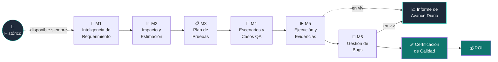
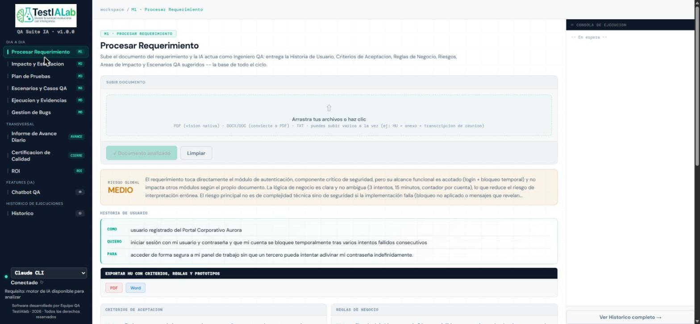
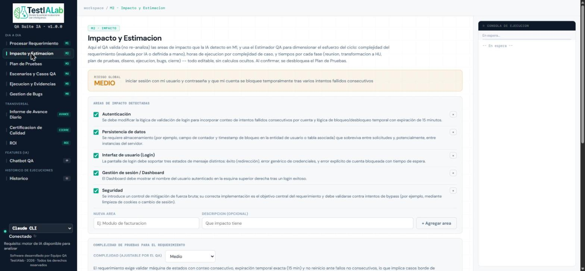
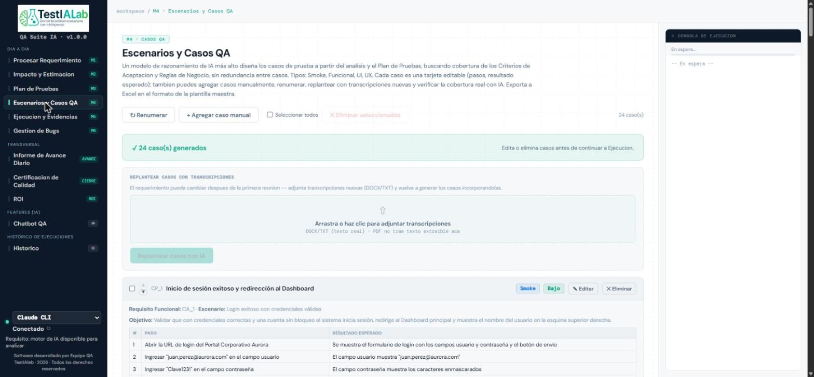
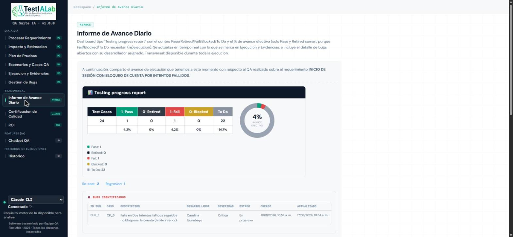

# 🧪 TestIALab QA Suite IA


**Copiloto de QA potenciado por IA que acompaña todo el ciclo de pruebas de software** — desde que llega un requerimiento hasta la certificación final de calidad — generando en el camino los documentos reales que hoy el equipo de QA de TestIALab producía a mano: Historia de Usuario, Plan de Pruebas, Casos de Prueba, Informe de Avance, Bug Tracker y Certificación de Calidad.

---

## 📌 ¿Qué es la QA Suite?

Cualquier ciclo de QA formal implica una cadena de documentos que dependen unos de otros: se analiza un requerimiento, se estima el esfuerzo, se redacta un plan de pruebas, se diseñan los casos, se ejecutan, se reportan los bugs, se informa el avance y finalmente se certifica la calidad. Hacer esto a mano es lento y propenso a que un documento pierda coherencia con el anterior.

La QA Suite usa un modelo de lenguaje (Claude o Gemini, a elección) como un **Ingeniero de QA senior** en cada etapa: lee el requerimiento real (texto, imágenes, tablas, wireframes), entiende el negocio, y produce cada documento del ciclo manteniéndolos coherentes entre sí — el Plan de Pruebas cita los mismos criterios que detectó el análisis inicial, los casos de prueba cubren exactamente esos criterios, y la Certificación final se apoya en lo que ya se aprobó en el Plan, sin volver a inventar el alcance desde cero.

Es una aplicación **100% local**: corre en la máquina del QA, no depende de ningún servidor externo propio, y todo el historial de ejecuciones vive en el navegador de quien la usa.

---

## 🔄 El ciclo completo, módulo por módulo


```mermaid
flowchart LR
    H(("📂<br/>Histórico")) -.disponible siempre.-> M1
    M1["🧠 M1<br/>Inteligencia de<br/>Requerimiento"] --> M2["📊 M2<br/>Impacto y<br/>Estimación"]
    M2 --> M3["📋 M3<br/>Plan de<br/>Pruebas"]
    M3 --> M4["🧩 M4<br/>Escenarios y<br/>Casos QA"]
    M4 --> M5["▶️ M5<br/>Ejecución y<br/>Evidencias"]
    M5 --> M6["🐞 M6<br/>Gestión de<br/>Bugs"]
    M5 -.en vivo.-> AV["📈 Informe de<br/>Avance Diario"]
    M6 -.en vivo.-> AV
    M6 --> CERT["✅ Certificación<br/>de Calidad"]
    CERT --> ROI["💰 ROI"]

    style H fill:#1e2a3a,color:#fff,stroke:#2dd4bf
    style AV fill:#1e2a3a,color:#fff,stroke:#2dd4bf
    style ROI fill:#0f766e,color:#fff
    style CERT fill:#0f766e,color:#fff
```

| Módulo | Qué hace | Qué produce |
|---|---|---|
| 📂 **Histórico** | Transversal, siempre disponible. Cada requerimiento analizado queda guardado con **todo** su avance — no solo el análisis, también casos, ejecución, bugs, plan y certificación. Autoguardado continuo; al recargar la página se puede retomar exactamente donde quedó. | Lista de sesiones guardadas, cargables en un clic |
| 🧠 **M1 · Inteligencia de Requerimiento** | Sube el documento del requerimiento (PDF, DOCX o TXT — pueden ser **varios a la vez**, ej. documento + anexo + transcripción de una reunión) y la IA los lee íntegramente como una sola fuente de verdad. | Historia de Usuario, Criterios de Aceptación, Reglas de Negocio, Riesgos, Áreas de Impacto y Escenarios QA sugeridos, con nivel de riesgo global justificado |
| 📊 **M2 · Impacto y Estimación** | El QA valida (no re-analiza) las áreas de impacto detectadas y usa el estimador para dimensionar el esfuerzo del ciclo completo. La complejidad la evalúa la IA como referencia (no mueve horas); la ejecución se calcula con el **ritmo del QA en casos por día**. | Complejidad del requerimiento y estimación editable por cada fase del ciclo (reunión, transformación a HU, plan, diseño fijo en 3h, ejecución = casos ÷ casos por día × 8h, bugs, cierre) |
| 📋 **M3 · Plan de Pruebas** | Documento formal de inicio de ciclo: objetivo, alcance dentro/fuera, supuestos, riesgos, estrategia, tipos y niveles de prueba, criterios de entrada/salida y responsables. | Plan de Pruebas exportable a **Word con el formato exacto de la plantilla real de TestIALab**, y a PDF |
| 🧩 **M4 · Escenarios y Casos QA** | Un modelo de razonamiento más alto diseña los casos de prueba a partir del análisis y el Plan de Pruebas, con cobertura de cada Criterio de Aceptación y Regla de Negocio, sin redundancia y **solo casos operativos ejecutables** en el ambiente (nada de carga/estrés). Incluye verificación de cobertura con IA, generación de lo faltante, **consolidación con los casos propios del QA o del cliente** (Excel con cualquier plantilla, CSV, Word o TXT: una sola versión final sin duplicados, con revisión antes de aplicar) e importación de Excel o casos manuales sin pasar por la IA. | Casos de prueba detallados (pasos + resultado esperado), con su origen (IA / QA / Cliente / Combinado), exportables a Excel en el formato de la plantilla maestra |
| ▶️ **M5 · Ejecución y Evidencias** | Espacio de trabajo caso por caso: se sube evidencia (imagen, PDF, DOCX, TXT, o se pega del portapapeles) y la IA emite un veredicto **Exitoso/Fallido** comparando la evidencia real contra el resultado esperado. El QA puede marcar un caso como **Bloqueado** (motivo + qué pasa con él: UAT o pendiente de insumo) o **Desestimado** (motivo). | Estado de cada caso con la hora del cambio, veredicto de IA con justificación por paso |
| 🐞 **M6 · Gestión de Bugs** | Registro y seguimiento de defectos: severidad, desarrollador asignado, caso relacionado, estado (Abierto/En progreso/Resuelto/Cerrado) e historial de cada cambio con fecha/hora. Al reportar desde un caso fallido, la IA **redacta el bug como un QA** (título, descripción, resultado esperado vs. obtenido, pasos para reproducir) y avisa si la falla parece de evidencia y no del sistema. | Bug exportable a Word individualmente, con el formato del Bug Tracker real |
| 📈 **Informe de Avance Diario** | Transversal, disponible durante toda la ejecución. Tablero de avance (Exitosos, Desestimados, Fallidos, Bloqueados, Sin ejecutar y % de avance efectivo) y secciones por estado siempre al día: bloqueados y desestimados con su motivo, bugs, pendientes solo como cantidad (con un detalle interno que no se exporta). | **Mensaje listo para pegar en Teams** (saludo, resumen, validaciones del día, bugs, bloqueos, pendientes, observaciones del QA) + **imagen compacta del tablero** |
| ✅ **Certificación de Calidad** | Cierre formal del ciclo: retoma el alcance ya aprobado en el Plan de Pruebas (no lo reinventa) y lo cruza contra la ejecución real, los motivos registrados por el QA y los bugs. Incluye el **informe de finalización para el grupo** (QA terminó, pasa al especialista / UAT). | Certificación exportable a Word y PDF con el formato real de TestIALab + mensaje e imagen de finalización para Teams + dossier de evidencias |
| 💰 **ROI** | Se habilita solo cuando el ciclo completo (incluida la Certificación) terminó. Compara el esfuerzo estimado vs. el real. | Comparativo de horas/costo por complejidad |

---

## 🤖 Motores de IA soportados

La Suite es agnóstica del motor — el QA elige con qué IA trabajar en cada análisis:

| Motor | Cómo corre | Notas |
|---|---|---|
| **Claude CLI** | CLI oficial de Anthropic (`claude`), invocada localmente por el backend | Motor recomendado para el análisis de requerimientos (M1) y el diseño de casos (M4) — sigue mejor las instrucciones de exhaustividad y cobertura |
| **Gemini** | Vía **Antigravity CLI** (`agy`), instalada con `winget` | Alternativa disponible en todos los módulos; en la práctica sigue con menos disciplina las instrucciones abiertas de exhaustividad frente a Claude |

El diseño de casos (M4) usa el modelo de razonamiento más alto disponible en cada motor, ya que es el paso más sensible a la calidad de la cobertura; el resto de los módulos usa un modelo estándar para mantener los tiempos de respuesta bajos.

---

## 💬 Chatbot QA — banco de conocimiento (RAG contra Confluence)

Módulo adicional para resolver dudas de proceso sin tener que ir a leer manuales: indexa un folder de Confluence Cloud con **embeddings 100% locales** (`@huggingface/transformers`, modelo `all-MiniLM-L6-v2`, sin costo de API externa) y responde citando la página exacta.

Solo se le envían al modelo los fragmentos relevantes a cada pregunta (búsqueda por similitud semántica), no el banco completo — esto reduce drásticamente el tamaño del prompt en bases de conocimiento grandes.

La fuente se configura con variables de entorno (mismo patrón que `CLAUDE_CLI_PATH`/`AGY_CLI_PATH`), a definir antes de arrancar el proxy:

| Variable | Descripción |
|---|---|
| `CONFLUENCE_BASE_URL` | URL base del sitio, ej. `https://tuempresa.atlassian.net` |
| `CONFLUENCE_EMAIL` | Correo de la cuenta que autentica contra la API |
| `CONFLUENCE_API_TOKEN` | Token generado en `id.atlassian.com/manage-profile/security/api-tokens` — nunca lo subas al repo |
| `CONFLUENCE_FOLDER_ID` | ID del folder/página raíz cuyas páginas descendientes se indexan (se ve en la URL de Confluence) |
| `CONFLUENCE_SYNC_MINUTES` | Opcional, cada cuántos minutos se vuelve a consultar la API (default `20`) — el índice se cachea entre preguntas para no pegarle a la API en cada mensaje |

Si estas variables no están definidas, el módulo responde con un error explícito en vez de fallar en silencio.

---

## 🖥️ Capturas de pantalla

<table>
<tr>
<td width="50%">

**M1 · Inteligencia de Requerimiento**


</td>
<td width="50%">

**M2 · Impacto y Estimación**


</td>
</tr>
<tr>
<td width="50%">

**M4 · Escenarios y Casos QA**


</td>
<td width="50%">

**Informe de Avance Diario**


</td>
</tr>
</table>

---

## ⚙️ Requisitos previos

- **Windows** (la exportación a PDF de Plan de Pruebas y Certificación automatiza Microsoft Word vía COM)
- **Node.js** 18 o superior (versión LTS de https://nodejs.org)
- **Git** (para clonar el repositorio)
- **Microsoft Word** instalado (para exportar Plan de Pruebas y Certificación a PDF)
- Al menos un motor de IA autenticado en la máquina:
  - **Claude CLI** (`npm install -g @anthropic-ai/claude-code`, luego `claude` y `/login` para autenticar), y/o
  - **Antigravity CLI** (`agy`, instalado vía `winget`; ejecutar `agy` sin argumentos para autenticar con la cuenta de Google de TestIALab)

## 🚀 Instalación paso a paso (primera vez)

1. **Instala Node.js**: descarga el instalador **Windows (LTS)** de https://nodejs.org y dale siguiente hasta terminar. Si el instalador ofrece instalar las herramientas adicionales (Chocolatey), acepta y deja que termine la ventana de PowerShell.
2. **Instala Git**: https://git-scm.com/download/win (o pídele a Claude Code que lo instale).
3. **Instala y autentica Claude Code**: en una terminal, `npm install -g @anthropic-ai/claude-code`, luego `claude` y `/login` con la cuenta de TestIALab.
4. **Clona el repositorio** en una carpeta, por ejemplo `C:\qa-suite`: `git clone <url del repositorio> C:\qa-suite`.
5. **Arranca la QA Suite**: doble clic en **`iniciar-qa-suite.bat`**. La primera vez instala las dependencias (`npm install`) sola; luego levanta el backend y abre **http://localhost:3001** en el navegador. Para detenerla, cierra esa ventana.

Desde una terminal también funciona:

```bash
npm install      # solo la primera vez (o cuando cambien las dependencias)
npm start        # equivale a: node proxy.js
```

Luego abrir **http://localhost:3001** en cualquier navegador (no importa con qué cuenta de Google o Microsoft esté abierto: la IA la usa el backend, no el navegador).

### Problemas comunes

| Mensaje | Qué hacer |
|---|---|
| `Cannot find module 'express'` (o cualquier otro módulo) | Faltan las dependencias: corre `npm install` en la carpeta del repositorio (o usa `iniciar-qa-suite.bat`, que lo hace solo). |
| `'node' no se reconoce como un comando...` | Node.js no está instalado o la terminal se abrió antes de instalarlo: instálalo y abre una terminal nueva. |
| `EADDRINUSE ... 3001` | Ya hay una QA Suite corriendo: usa esa (http://localhost:3001) o cierra la otra ventana. |
| El sidebar dice que el motor de IA no está disponible | Abre una terminal, ejecuta `claude` y autentícate con `/login` (o `agy` para Gemini). |

## 💾 Persistencia

No hay base de datos en el backend — todo el historial de ejecuciones se guarda en **IndexedDB del navegador** (autoguardado continuo, cada pocos segundos y en cada cambio de estado importante). Esto significa que una ejecución en curso nunca se pierde por cerrar la pestaña o apagar el equipo, pero también que el historial vive en ese navegador específico, no en un servidor compartido entre QAs.

## 📁 Estructura del repositorio

```
QA-Suite/
├── proxy.js              # Backend (Express) -- orquesta las llamadas a Claude/Gemini y genera los .docx/.pdf/.xlsx
├── qa-suite.html          # Frontend completo (aplicación de una sola pagina)
├── iniciar-qa-suite.bat   # Arranque con doble clic (instala dependencias la primera vez)
├── .claude/memory/        # Memoria del proyecto para Claude Code (decisiones, estado, flujo de trabajo)
├── assets/                # Logo y recursos estaticos
├── Demo/                  # Requerimiento, artefactos generados y evidencias de una demo de referencia
├── docs/screenshots/      # Capturas usadas en este README
└── HANDOFF-TestIALab-QA-Suite.md   # Estado actual al inicio + bitácora de la primera versión
```

## 🌿 Estado del proyecto y flujo de trabajo

Proyecto en **desarrollo activo**. El repositorio sigue un flujo `main` / `develop` / `feature`:

- `main` — versión estable, solo recibe merges vía Pull Request desde `develop`.
- `develop` — integración del trabajo del día a día, solo recibe merges vía Pull Request desde ramas `feature/*`.

## 📜 Licencia

**Propietario — Todos los derechos reservados.**
© 2026 TestIALab. Este código es de uso interno y no está licenciado para copia, modificación, distribución o uso por terceros sin autorización expresa por escrito de TestIALab.

## ✍️ Autoría

Desarrollado por **Esteban Rodríguez** para el equipo de QA de **TestIALab**, con asistencia de Claude Code (Anthropic).
